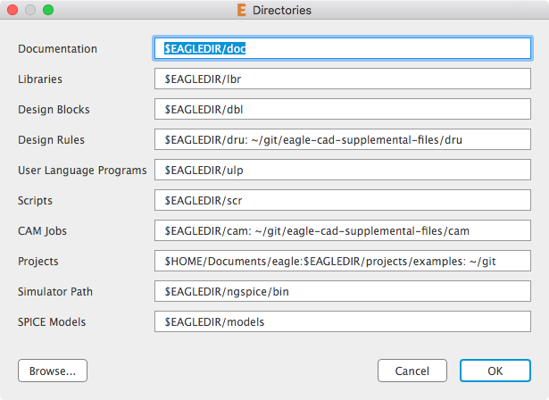

# eagle-cad-supplemental-files

This repository contains the settings for our board house and any other files we need to keep separate from EAGLE installations and updates.

In EAGLE, click **_View -> Directories_** and add the path(s) to this repository.

On Mac, separate the paths with colons.  Use semicolons in Windows.

